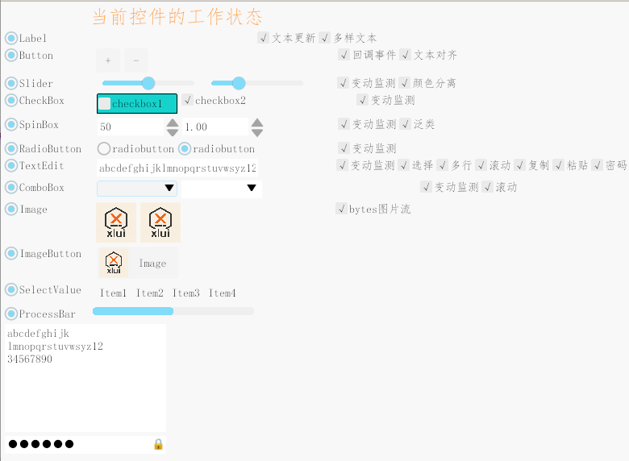
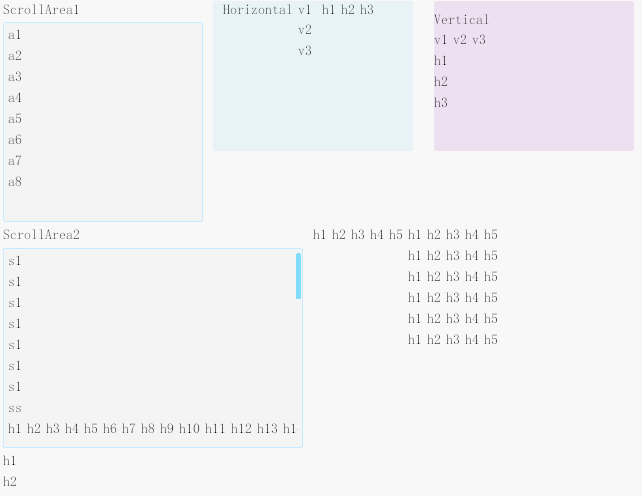

## 0.2.0 - 2025-09-14 原生窗口管理 [#2](https://github.com/xllgl2017/xlui/issues/2)

&nbsp;&nbsp;&nbsp;&nbsp; xlui是一个用Rust语言，基于原生窗口和wgpu实现的2D GUI库。
目标是利用Rust语言原生构建GUI、最小第三方依赖、体积小（比winit+wgpu少50%左右）、简单易用， 在保证性能的前提下尽量减少CPU的开销。

## 原生窗口支持

### Windows

* 更小的依赖，更小的体积

  
* 支持系统托盘

  

### Linux

* 更小的依赖，更小的体积

  

* 更好的IME支持

  

## 控件

### Label

* ✅文本对齐
* ✅富文本

### TextEdit

* ✅多行文本
* ✅密码文本
* ✅复制和粘贴(仅原生窗口支持)

### ScrollWidget

* 支持水平和垂直滚动

  

#### ListView

* 使用RecycleLayout，ListView的数据量可达10w（debug模式）

  
  

## 窗口

### 系统托盘（Windows）

### 自定义字体和全局字号

### 子窗口

   

&nbsp;&nbsp;&nbsp;&nbsp; xlui是一个用Rust语言，基于原生窗口和wgpu实现的2D GUI库。
目标是利用Rust语言原生构建GUI、最小第三方依赖、体积小（比winit+wgpu少50%左右）、简单易用， 在保证性能的前提下尽量减少CPU的开销。

## 原生窗口支持

### Windows

* 更小的依赖，更小的体积

  
* 支持系统托盘

  

### Linux

* 更小的依赖，更小的体积

  

* 更好的IME支持

  

## 控件

### Label

* ✅文本对齐
* ✅富文本

### TextEdit

* ✅多行文本
* ✅密码文本
* ✅复制和粘贴(仅原生窗口支持)

### ScrollWidget

* 支持水平和垂直滚动

  

#### ListView

* 使用RecycleLayout，ListView的数据量可达10w（debug模式）

  
  

## 窗口

### 系统托盘（Windows）

### 自定义字体和全局字号

### 子窗口

   

## 0.1.0 - 2025-08-20 [#1](https://github.com/xllgl2017/xlui/issues/1)

&nbsp;&nbsp;&nbsp;&nbsp;&nbsp;&nbsp;&nbsp;xlui是一个Rust的2D GUI库。目标是利用Rust语言原生构建GUI、体积小(最小第三方依赖)
，简单易用，在保证性能的前提下尽量减少CPU的开销。

### 目前支持的控件

|     名称      |                    工作状态                    |
|:-----------:|:------------------------------------------:|
|    Label    |                ✅文本显示 ⬜️文本样式                |
|   Button    |             ✅事件回调 ✅按钮样式 ⬜️文本对齐             |
|   Slider    |                 ✅值监测 ⬜️样式                  |
|  CheckBox   |                   ✅事件监听                    |
|   SpinBox   |            ✅值监测 ✅支持泛型 ✅键盘输入 ✅长按            |
| RadioButton |                   ✅事件监听                    |
|  TextEdit   | ✅值监测 ✅文本选择 ✅键盘输入 ✅文本滚动 ⬜️多行 ⬜️复制 ⬜️粘贴 ⬜️密码 |
|  ComboBox   |                ✅变动监测 ✅弹窗滚动                 |
|    Image    |            ✅本地图片 ✅网络图片 ⬜️字节集图片             |
| ImageButton |                   ✅事件回调                    |
| SelectValue |                ✅控件关联 ⬜️变动监测                |
|  ListView   |        ✅添加Item ✅删除Item ✅变动监测 ⬜️超大数据        |

* 控件运行示例
  

### 目前支持的布局

|        名称        |        工作状态        |
|:----------------:|:------------------:|
| HorizontalLayout |     ✅左到右 ⬜️右到左     |
|  VerticalLayout  |     ✅上到下 ⬜️下到上     |
|    ScrollArea    | ✅垂直滚动 ✅快速滚动 ⬜️水平滚动 |
|      Popup       |                    |

* 布局运行示例
  