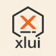

# 🚀 xlui: 
[](https://github.com/xllgl2017/xlui) [](https://crates.io/crates/xlui) [](https://github.com/xllgl2017/xlui/blob/main/LICENSE-APACHE)
### 示例
```rust
fn main() {
    XlUiApp::new().run();
}

struct XlUiApp {
    label: Label,
    count: i32,
}

impl XlUiApp {
    pub fn new() -> Self {
        Self {
            label: Label::new("hello".to_string()).width(100.0),
            count: 0,
        }
    }

    pub fn add(&mut self, uim: &mut UiM) {
        self.count += 1;
        self.label.set_text(format!("count: {}", self.count));
        self.label.update(uim);
    }

    pub fn reduce(&mut self, uim: &mut UiM) {
        self.count -= 1;
        self.label.set_text(format!("count: {}", self.count));
        self.label.update(uim);
    }

}

impl App for XlUiApp {
    fn draw(&mut self, ui: &mut Ui) {
        self.label.draw(ui);
        ui.horizontal(|ui| {
            Button::new("+".to_string()).width(30.0).height(30.0).connect(Self::add).draw(ui);
            Button::new("-".to_string()).width(30.0).height(30.0).connect(Self::reduce).draw(ui);
        });
    }

    fn window_attributes(&self) -> WindowAttribute {
        WindowAttribute {
            inner_size: (800, 600).into(),
            ..Default::default()
        }
    }
}
```

## 控件(目前可用)
### ✅ Label
```rust
fn draw(&mut self, ui: &mut Ui) {
    ui.label("hello label");
    //或者
    Label::new("hello label").draw(ui);
}
```

### ✅ Button
```rust
fn draw(&mut self, ui: &mut Ui) {
    ui.button("hello button").connect(Self::clicked);
    //或者
    Button::new("hello label").connect(Self::clicked).draw(ui);
}
```

### ✅ Slider
```rust
fn draw(&mut self, ui: &mut Ui) {
    ui.slider(30.0, 0.0..100.0).connect(Self::slider);
    //或者
    Slider::new(10.0).with_range(0.0..100.0).connect(Self::slider).draw(ui);
}
```

### ✅ SpinBox
```rust
fn draw(&mut self, ui: &mut Ui) {
    ui.spinbox(1, 0..10).connect(Self::changed);
    //或者
    SpinBox::new(1).with_range(0..10).connect(Self::changed).draw(ui);
}
```

### ✅ CheckBox
```rust
fn draw(&mut self, ui: &mut Ui) {
    ui.checkbox(true, "checkbox1").connect(Self::checked);
    //或者
    CheckBox::new(false, "checkbox2").connect(Self::checked).draw(ui);
}
```
### ✅ Image
```rust
fn draw(&mut self, ui: &mut Ui) {
    ui.image("logo.jpg", (200.0, 200.0));
    //或者
    Image::new("logo.jpg").with_size(200.0, 200.0).draw(ui);
}
```

### ✅ RadioButton
```rust
fn draw(&mut self, ui: &mut Ui) {
    ui.radio(true, "radiobutton").connect(Self::radio);
    //或者
    RadioButton::new(false, "radiobutton").connect(Self::radio).draw(ui);
}
```

### ✅ ScrollBar(垂直)

### ⬜️ TextEdit

## 布局

### ✅ Layout(垂直、水平)
```rust
fn draw(&mut self, ui: &mut Ui) {
    ui.horizontal(|ui| {
        //...
    });
    ui.vertical(|ui| {
        //...
    });
}
```

### ✅ ScrollArea(垂直)
```rust
fn draw(&mut self, ui: &mut Ui) {
    let area = ScrollArea::new().with_size(300.0, 400.0);
    area.show(ui, |ui| {
        ui.label("start");
        ui.vertical(|ui| {
            ui.label("sv1");
            ui.label("sv2");
            ui.button("sv3").connect(Self::click1);
        });
        ui.horizontal(|ui| {
            ui.label("sh1");
            ui.label("sh2");
            ui.button("sh3");
        });
        for i in 0..1000 {
            ui.label(format!("i{}", i));
        }
        ui.label("end");
    });
}
```


[//]: # (❌)
